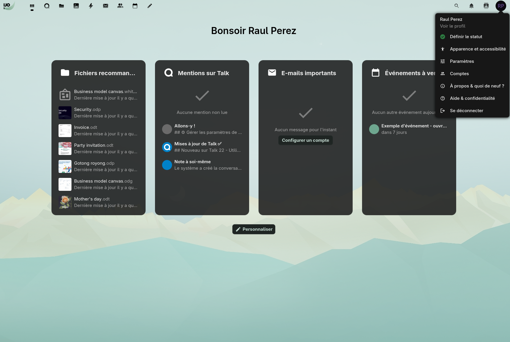
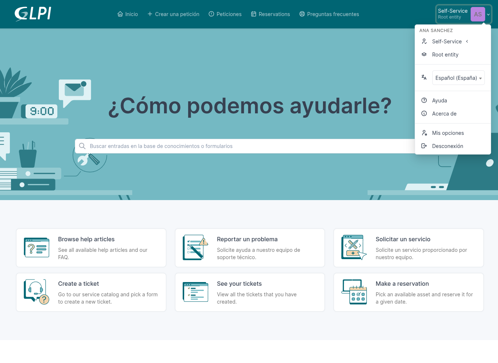
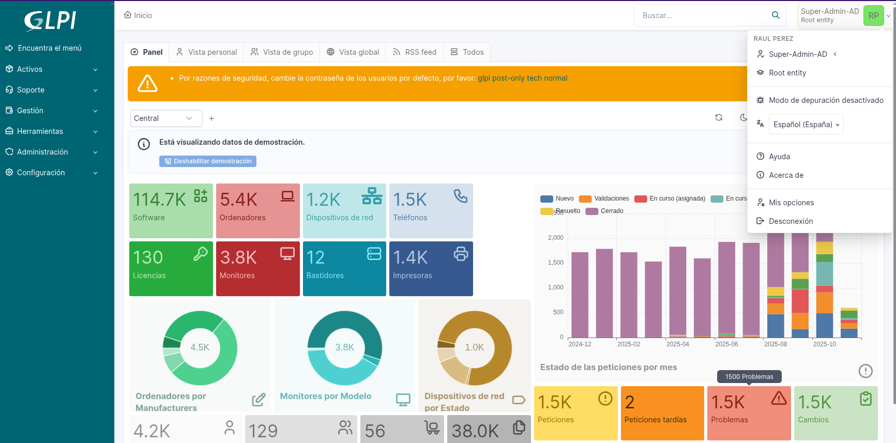
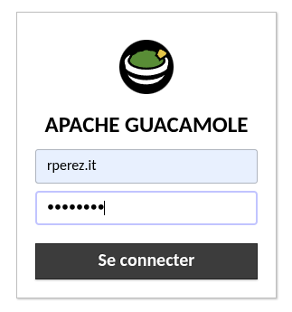
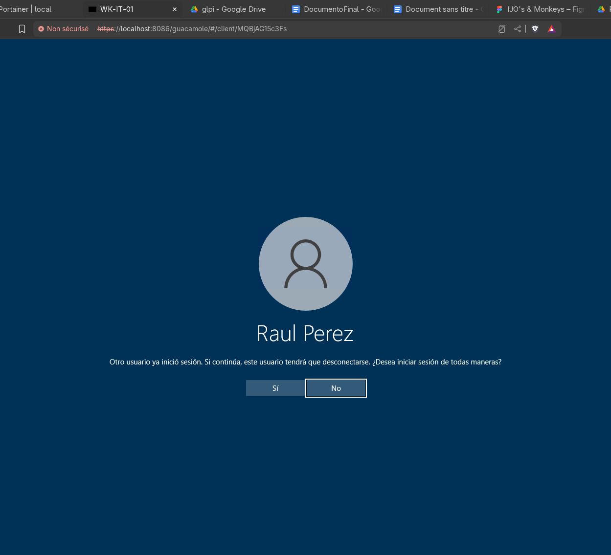
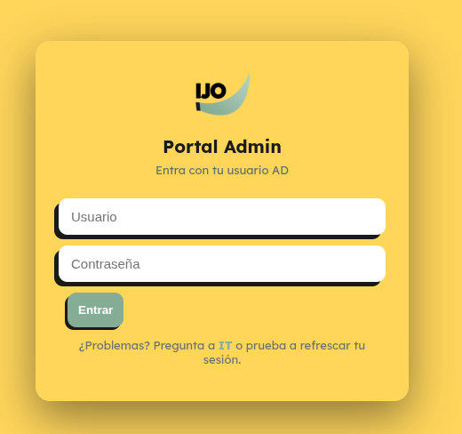
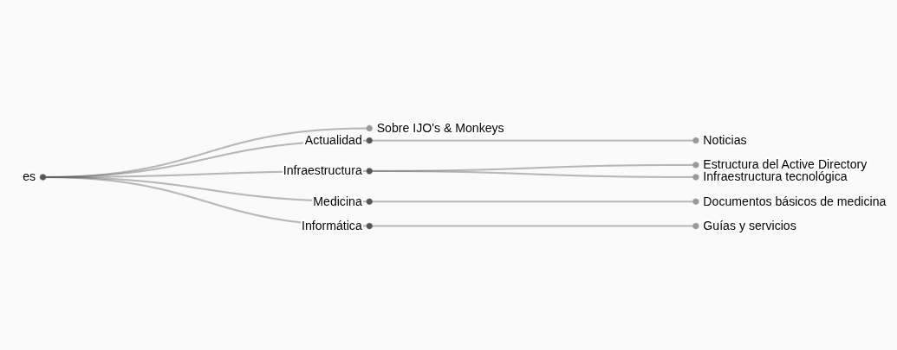

# IJO's & Monkeys: full deployment

As part of a class project, I was invited to create a fictitious NGO and prepare a full deployment of its entire infrastructure. In addition, I decided to enhance the NGO environment with a wide range of services designed to help volunteers work in a more user-friendly setting.

## Brand Identity

__IJO's & Monkeys__ is inspired by the world of monkeys. Therefore, it’s important to reflect this theme and invite people to engage with it. That’s why I introduced this *vibrant* and *relaxing* palette of colors and shapes. Every detail is designed to be inviting and purposeful.

For more information about the visual identity, you can check the [brand identity document](https://www.figma.com/proto/FvkwMxSvWmPA1vEL3Y4sY0/IJO-s---Monkeys?node-id=1-7&m=draw&scaling=scale-down&content-scaling=fixed&page-id=0%3A1&t=kzD0nNhAGmwqFrXq-1).

## Infrastructure

The main goal of the project was to provide a *fully controlled domain* managed by a `Windows Server`. Additionally, several services run on a separate `Ubuntu Server` inside containers managed by `Portainer`. Every user has a unique account and email within the domain, allowing them to log in to all services and applications seamlessly.

### Network

Since the project is implemented in a __virtualized environment__ using `Proxmox`, `OPNsense` is used as the router and firewall. The network is divided as follows:

| Nombre | Red            | Función                      |
| :----- | :------------- | :--------------------------- |
| WAN    | 10.10.16.0/24  | Acts as the public network   |
| LAN    | 192.168.2.0/24 | Hosts the NGO users’ devices |
| DMZ    | 192.168.1.0/24 | Hosts the servers            |

Server access is __restricted__ and can only be performed using a __key__ via `SSH`.

### DNS

The gateway responsible for network traffic and domain name translation is `OPNsense`. It handles tasks such as routing, firewalling, and DNS forwarding, ensuring that requests to internal services are correctly directed.

Here are some subdomains used in the project:

| Nombre      | Dominio           |
| :---------- | :---------------- |
| web         | ijo.org           |
| Nextcloud   | cloud.ijo.org     |
| GLPI        | glpi.ijo.org      |
| Guacamole   | guacamole.ijo.org |
| Rocket.chat | rocket.ijo.org    |
| PortalAD    | portal.ijo.org    |
| Wikijs      | wiki.ijo.org      |

### Active Directory

Here is the schema of the __domain structure__:

In addition, here are some interesting GPOs applied to users:

| GPO                       | Purpose                                                      |
| :------------------------ | :----------------------------------------------------------- |
| Background Policy         | Sets a custom desktop background depending on the user group |
| Remote Access             | Allows the *G-IT* group to connect via RDP using Guacamole   |
| GLPI Agent silent install | Enables automatic remote inventory installation              |

### Services

An NGO deserves services that are up to the task. Here are the services that have been configured. All of them are accessed through a reverse proxy using `Nginx` and secured with self-signed certificates issued by a private CA, which automatically generates certificates for each service.

- Nextcloud
- GLPI
- Guacamole
- Rocket.chat
- PortalAD
- Wikijs
- MailServer

All services are available to users via their Active Directory accounts. In the backend, the connection to AD is secured with TLS/SSL using LDAPS. User roles are consistently maintained across all services, with careful attention to every detail.

#### Nextcloud

The heart of the NGO: here, users can share files in the cloud and access their data from anywhere. Users log in with their __sAMAccountName__, and permissions are controlled, with administrators belonging to the *G-IT* group.

Additionally, users can access their email through the mail application.

#### GLPI

Users have access to a complete ticketing system to report any issues with their equipment. Administrators maintain full control using the `GLPI Agent` plugin, which automates inventory management and keeps everything organized.

The *G-IT* group has administrator-level access:

#### Guacamole

Only administrators in the *G-IT* group have access here.

Inside, all connection groups are available, allowing access to devices via `RDP` or `SSH`.

#### Rocket.chat

Users have team chats as well as an NGO-wide news chat that includes all members.

#### PortalAD

A custom application built with `Node.js` that allows the *G-IT* and *G-Secretaria* groups to register new users in the domain through a web interface.

#### Wiki.js

To provide a useful information source for all users, there is a public wiki with the following restrictions:

1. Documents in __/informatics__ are only accessible to domain users and managed by the *G-IT* group. This section contains useful tutorials for users who have questions about the equipment.
2. Documents in __/medicine__ are managed and editable only by *G-Veterinarios*. Everyone can view these documents, but the information must be accurate and of high quality.
3. Documents in __/infra__ are only accessible to the *G-IT* group, as they contain technical documentation about the NGO’s IT infrastructure.
4. In __/news__, all domain users can upload current news documents, and they are visible to everyone.

#### MailServer

All users have a corporate email account under the domain __ijo.org__ thanks to this service, which uses dovecot and postfix. Authentication is performed against the __AD__, and since each user has their own email account, everyone can access it. Additionally, the protocols `IMAP` over TLS/SSL on port __993__ and `SMTP` with STARTTLS on port __587__ are used.

---

For more details about the project, feel free to contact me and visit my [portfolio](https://inakiportfolio.netlify.app/)

*Iñaki Spinardi*